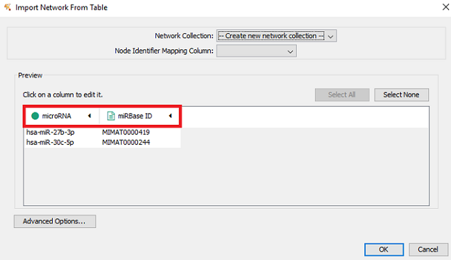
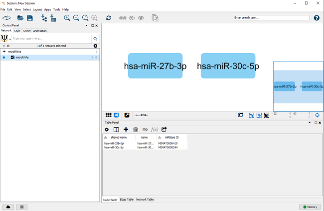

# Tutorial 1
## Extend a set of microRNAs with target information

CyTargetLinker provides a quick and extensive enrichment of networks in Cytoscape. The visualization options allow biological interpretation of complex regulatory networks in a graphical way.

In this tutorial, a step-by-step explanation is given on how to extend a list of microRNAs with predicted and validated microRNA-target interactions (MTIs).
The tutorial was created for the following versions:
* Cytoscape v3.7.1 
* CyTargetLinker app v4.1.0

## Step 1: Import a set of microRNAs into Cytoscape

First you will need to create a biological network in Cytoscape containing your microRNAs of interest. The datafile should contain at least two columns, (i) the microRNA name and (ii) the corresponding miRBase accession number. 
An example datafile, in which two microRNAs known to be involved in obesity are listed, can be downloaded from here (microRNA.xlsx). 

* Open the datafile containing the microRNAs in Cytoscape via **File -> Import -> Network from File**. Select the downloaded microRNA.xlsx file.
* Specify the **microRNA** column as the **Source Node** (click on header and select green circle) and the **miRBase ID** as a **Source Node Attribute** (green data sheet), as shown in Figure 1. 
* After clicking **'OK'**, you will receive the following warning: "No edges will be created in the network; the source column is not selected. Do you want to continue?". Click **'Yes'**.

The resulting biological network of two microRNAs from the example data, as shown in Figure 2.

